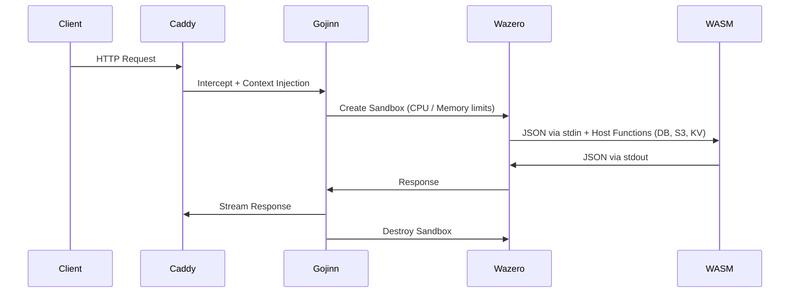

# 🧞 Gojinn
[](https://pkg.go.dev/github.com/pauloappbr/gojinn)

[]()
[](https://wazero.io)
[](https://github.com/sponsors/pauloappbr)

> **A Sovereign, In-Process Serverless Runtime for Caddy**
> Execute untrusted code securely with WebAssembly — no containers, no orchestration, no control plane.

Gojinn is a **high-performance WebAssembly runtime embedded directly into the Caddy web server**.
It allows you to run isolated, deterministic functions *inside the HTTP request lifecycle* — safely and with near-native performance. It replaces the complexity of K8s + API Gateways with a single, auditable binary.

---

## 🔑 What Gojinn Is (and Is Not)

### ✅ Gojinn is
- A **WASM-based serverless runtime** powered by Wazero.
- **Single-binary**, self-hosted, and sovereign.
- A complete stateful platform (Embedded NATS JetStream, SQLite/LibSQL, S3 bindings).
- Deterministic, sandboxed, and capability-based (Ed25519 module signing).

### ❌ Gojinn is NOT
- A container orchestrator or Kubernetes replacement.
- A managed cloud service.
- A general-purpose VM or process supervisor.

> Gojinn executes **code and events** — not infrastructure.

---

## 🚀 Key Features

Gojinn goes beyond execution. It provides a complete sovereign cloud primitives out-of-the-box:

* **⚡ In-Process Execution:** No network hops, zero idle cost. Cold starts in `<1ms`.
* **🔐 Cryptographic Sovereignty:** Strict Ed25519 signature verification for all WASM modules before execution.
* **💾 Built-in State & Storage:** Host-level connection pooling for SQLite/LibSQL, embedded S3 client, and isolated Key-Value stores per tenant.
* **📨 Embedded Message Broker:** Integrated NATS JetStream for async background jobs, MQTT event triggers, and multi-tenant queues.
* **🧠 AI & Agentic Routing:** Native LLM integration with semantic routing and Model Context Protocol (MCP) tool exposure.
* **⏪ Time-Travel Debugging:** Automatic crash dumps capturing memory state and inputs, replayable locally via CLI.

---

## 🏗 High-Level Architecture

Gojinn runs **inside Caddy**, not behind it.



Read the full Architecture Concepts and Threat Model.

---

## 🛠 Tooling & Installation

Gojinn ships with a powerful CLI to manage your sovereign cloud.

### 1. Install via xcaddy (Server)

```bash
xcaddy build --with github.com/pauloappbr/gojinn
```

### 2. The Gojinn CLI

Develop, sign, and deploy with the native CLI toolkit:

- `gojinn init [name]` - Scaffold a new WASM function (HTTP or WebSocket Actor).
- `gojinn up` - Build all functions, sign binaries, and start the Caddy server.
- `gojinn deploy [path]` - Hot-reload a single function without dropping traffic.
- `gojinn replay [crash.json]` - Load a crash dump for local time-travel debugging.

---

## ⚙️ Configuration (Caddyfile)

```caddyfile
{
    order gojinn last
    admin :2019
}

:8080 {
    handle /api/* {
        gojinn ./functions/processor.wasm {
            timeout 2s
            memory_limit 128MB
            pool_size 10
            
            # Embedded Services
            db_driver sqlite3
            db_dsn ./data/tenant.db
            s3_bucket "sovereign-data"
            
            # Security Policies
            security {
                policy strict
                trusted_key {env.PUB_KEY}
            }
        }
    }
}
```

Full reference: `docs/reference/caddyfile.md`


## 🧩 Polyglot SDKs

Gojinn uses a strict JSON protocol over stdin/stdout and exposes advanced capabilities via Host Functions (WASI). We provide official SDKs for seamless integration:

- **Go:** `import "github.com/pauloappbr/gojinn/sdk"`
- **Rust:** Supported via `sdk/rust/`
- **JavaScript/TypeScript:** Supported via `sdk/js/` and Javy

See the Contract Definition for writing raw WASM modules.


## 📊 Observability

Built for operational rigor, no sidecars required:

- **Metrics:** Prometheus (`http://localhost:2019/metrics`)
- **Tracing:** OpenTelemetry (Context propagation across NATS and HTTP)
- **Logs:** Structured, via Caddy

---

## 📚 Documentation

- [Getting Started & Installation](docs/getting-started/installation.md)
- [Deployment Guide](docs/guides/deployment.md)
- [Debugging & Crash Replay](docs/guides/debugging.md)
- [Use Cases](docs/use-cases.md)
- [Design Document](DESIGN.md)
- [Project Whitepaper](docs/WHITEPAPER.md)


## 🧭 Project Direction

Gojinn is built with long-term correctness, not short-term convenience.

- [Roadmap](ROADMAP.md)
- [FAQ](FAQ.md)
- [Governance](GOVERNANCE.md)


## 🤝 Contributing & Community

Gojinn is currently in its early, active development phase. As I am currently laying down the core architecture, I am actively looking for passionate contributors to join the effort! Whether you are interested in Go, WebAssembly, Caddy internals, or just want to help build a sovereign cloud tool, your PRs, issues, and ideas are highly welcome.

---

## 💖 Sponsors & Supporters

Building a robust, open-source serverless runtime takes time and dedication. If Gojinn is useful to you or your company, consider supporting the project!

### Official Sponsors
We are incredibly grateful to our official sponsors for supporting the development of Gojinn:

---

## 📄 License

[Apache License 2.0](LICENSE)