# 🏛️ Architecture and Functionality

Gojinn proposes a fundamental shift in how we think about "Serverless". Instead of moving data to computation (sending requests to distant containers), we bring computation to the data (executing code within the web server itself).

This approach is called **In-Process Serverless**.

With the release of **v0.3.0**, Gojinn utilizes a **Worker Pool Architecture** combined with a JIT Caching Engine to achieve sub-millisecond latency.

## 🔄 Request Lifecycle

Unlike Docker (which starts a container) or older WASM runtimes (which instantiate engines on every request), Gojinn separates the lifecycle into two distinct phases: **Provision** and **Execution**.

### Phase 1: Provisioning (Parallel Boot)

When Caddy starts (or reloads via API), Gojinn performs the heavy lifting immediately:

1.  **Read & Compile**: The `.wasm` file is read and compiled into Native Machine Code (JIT) via Wazero.
2.  **Pool Allocation**: Gojinn calculates the optimal `pool_size` (or uses the user config) and creates a buffered channel.
3.  **Parallel Warm-up**: It spins up multiple `wazero.Runtime` instances in parallel (Goroutines). Each worker is pre-loaded with the compiled code and system host functions.
4.  **Ready State**: The workers sit in the pool (channel), consuming minimal resources, waiting for traffic.

### Phase 2: Execution (The Hot Path)

When a Request arrives, there is no disk I/O, no compilation, and no heavy initialization.

#### Request Lifecycle Diagram

```mermaid
sequenceDiagram
    participant Client
    participant Caddy
    participant Gojinn
    participant Pool as Worker Pool (Channel)
    participant Wasm as Wasm Runtime
    
    Note over Caddy, Pool: Phase 1: Provisioning (Startup)
    Caddy->>Gojinn: Load Plugin
    Gojinn->>Gojinn: JIT Compile .wasm (Once)
    Gojinn->>Pool: Spawn N Workers (Parallel Boot)
    
    Note over Client, Pool: Phase 2: Execution (Hot Path)
    Client->>Caddy: HTTP Request
    Caddy->>Gojinn: Routes to Handler
    
    rect rgb(20, 20, 20)
        Gojinn->>Pool: Acquire Warm Worker (<- pool)
        Pool-->>Gojinn: Returns EnginePair (Runtime + Code)
        
        Gojinn->>Wasm: Fast Instantiate
        activate Wasm
        Wasm->>Wasm: Execute Logic (Go/Rust/Zig)
        Wasm-->>Gojinn: Write JSON Response
        deactivate Wasm
        
        Gojinn->>Pool: Return Worker (pool <- pair)
    end
    
    Gojinn->>Caddy: Return Response
    Caddy->>Client: HTTP 200 OK
```

## 📋 Optimization Techniques (v0.3.0)

- **Worker Pooling (New)**: Instead of creating a new runtime for every request, we reuse a pool of pre-configured runtimes. This drops the overhead from milliseconds to microseconds
- **JIT Caching**: We compile the WASM binary to CPU native instructions (AOT/JIT) only once during startup
- **Buffer Pooling**: We use `sync.Pool` to reuse memory buffers for Standard I/O. This prevents the Go Garbage Collector from spiking during high traffic
- **Zero-Copy Networking**: Data flows from Caddy's memory to the WASM sandbox linear memory without passing through OS network sockets

## 🆚 In-Process vs. Sidecar/Container

Gojinn's biggest advantage is eliminating the Network Hop, the OS Overhead, and the Cold Start penalty.

### Traditional Architecture (Docker/K8s)

- **The Cost**: Network latency + OS Context Switch + Kernel Boot Time + Idle RAM usage
- **The Scale**: Limited by available RAM (approx. 20-50 containers per node)
- **Cold Start**: 500ms to 2s

### Gojinn Architecture (In-Process)

- **The Cost**: Only CPU cycles. Zero internal network latency
- **The Scale**: Limited only by CPU. You can run 10,000+ functions on a single node because idle functions are just cached bytes in RAM
- **Cold Start**: < 1ms (Pre-warmed Pool)

### Comparison Table

| Feature | Docker / K8s Pod | Gojinn v0.3.0 | Winner |
|---------|------------------|---------------|--------|
| Communication | Network (HTTP/gRPC) | Memory (Stdin/Stdout) | 🏆 Gojinn |
| Isolation | Kernel Namespaces (OS) | Memory Sandbox (Software) | 🤝 Tie (Different models) |
| Cold Start | 500ms to 2000ms | < 0.5ms (Pooled) | 🏆 Gojinn |
| Warm Latency | ~4ms overhead | Microseconds | 🏆 Gojinn |
| Density | ~20 containers per node | 10,000+ functions per node | 🏆 Gojinn |
| Idle Usage | High (Container daemon) | Zero (Just RAM cache) | 🏆 Gojinn |

## 🛡️ Isolation and Security

You might ask: "Running third-party code inside my web server isn't dangerous?"

Gojinn uses **Wazero**, a secure WebAssembly runtime written in pure Go with zero CGO dependency.

### Memory Safety

The WASM module cannot access any memory address outside of what was allocated for it (The Sandbox). It cannot read Caddy's private keys or data from other requests.

### No System Access

By default, the module has no access to:

- Files (open)
- Network (connect)
- Environment variables

Unless explicitly allowed via the Caddyfile (`env` directive) or future Host Functions.

### Crash Safety

If the Go/Rust code panics or attempts to violate memory limits, the virtual machine is instantly terminated. The main Caddy process does not crash, the worker is safely replaced or reset, and a 500 Error is returned to the client securely.